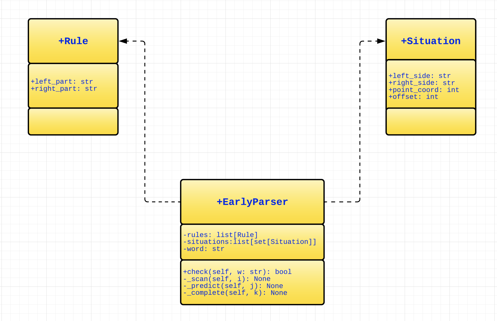

# Algorithm Early
Run test_pareser.py to check if a word (from the words list) is generated by a context-free grammar (from the list rules). You get the message '{amount_of_tests} passed' if all your answers from your cases are true. Else you get the message about failed tests with details.
# UML

